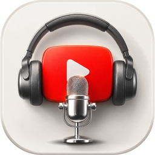

# YouTube Voice Controller

Control YouTube with your voice - no hands, no mouse. Say a command and the app does the rest.

<br clear="left"/>


---

## Features

- **Voice commands** - play, pause, volume, fullscreen, subtitles, like, rewind and more
- **Voice search** - say "search" and name your query, the app finds videos via YouTube API
- **Pick a result by voice** - say "open first", "second"... "tenth" to open the video
- **YOLO button detection** - the app finds Like / Dislike / Skip Ad buttons on screen and clicks them
- **Runs in background** - minimizes to tray and keeps listening
- **Automatic GPU to CPU fallback** - works on any hardware
- **Optimized for low-end hardware** - runs smoothly even on 10-year-old machines

---

## How It Works

**Two-level speech recognition using separate neural network models:**
- **Vosk** - fast offline keyword recognition (grammar-constrained), always running
- **Whisper** - accurate free-form speech transcription, used only in search mode

**YOLO inference:**

A custom YOLOv8n model trained to detect three types of on-screen objects: Like button, Dislike button, and Skip Ad button. These YouTube UI elements cannot be triggered via keyboard shortcuts, so the app uses computer vision to locate and click them. YOLOv8 nano delivers excellent inference speed and is well suited for this task. By default the app runs inference on GPU (supports many discrete and integrated GPUs via DirectML); if GPU is unavailable, it falls back to CPU automatically. GPU provides a significant speedup - roughly 5-20x depending on hardware. Even on modern CPUs, object detection takes a fraction of a second.

- Screen is split into 8 tiles (4x2); bottom tiles are checked first - that is where YouTube controls live
- Early exit when detection confidence reaches >= 0.6

**Pipeline:**
```
Microphone -> Vosk model (keywords) -> CommandDispatcher
                                           |- Whisper model  (free-form search query)
                                           |- Keyboard shortcut  (play/pause/volume/...)
                                           |- YOLO visual click  (like/dislike/skip ad)
                                           |- YouTube API search  (search + first/second/...)
```

---

## Voice Commands

Say **"YouTube"** to activate, then give a command within 15 seconds.

| Command | Action |
|---|---|
| open | Open YouTube |
| play / pause / stop / resume | Play / Pause |
| next / forward | Next video |
| rewind / replay / again | Rewind 10 sec |
| louder / volume up | Volume up |
| quieter / volume down / softer | Volume down |
| mute / unmute | Toggle mute |
| fullscreen / maximize / minimize | Toggle fullscreen |
| like / thumbs up | Like |
| dislike / thumbs down | Dislike |
| skip / skip ad | Skip advertisement |
| subtitles / captions | Toggle subtitles |
| back / previous / go back | Browser back |
| search | Voice search |
| first ... tenth | Open N-th search result |

---

## Tech Stack

| Component | Technology |
|---|---|
| Platform | .NET 8, WinForms, x64 |
| Language | C# |
| Speech recognition | Vosk + Whisper.net neural network models |
| Computer vision | Custom YOLOv8n model, ONNX Runtime, DirectML |
| Audio processing | NAudio |
| YouTube API | YouTube Data API v3 |

---

## Installation

1. Download the latest release (*.exe or *.zip)
2. Run the installer or extract the archive
3. Launch YouTube Voice Controller.exe
4. Click **Start** and say "YouTube" (the app starts listening) => "open" (opens YouTube in your browser if it is not already open)

Works with Chrome, Edge and Firefox.

---

## YouTube API (for voice search)

Voice search requires a YouTube Data API v3 key. Without it, all other commands (play / pause / volume / etc.) work fully. The release build includes an API key on my account so you can try all features out of the box. For your own projects, please follow the instructions below to register your own key - it takes 1-2 minutes and keeps us both within Google's usage policies. Thank you! :)

How to get a key: Google Cloud Console -> create a project -> enable YouTube Data API v3 -> create an API Key. For a step-by-step guide see [GET_API_KEY.md](GET_API_KEY.md).

---

## System Requirements

- Windows 10 / 11 (x64)
- Chrome, Edge or Firefox
- Microphone. Best experience with a headset since speakers won't bleed into the mic - but the app also works well with laptop built-in mic/speakers and webcam microphones
- GPU with DirectML support (optional - works without one)

---

## License

MIT
